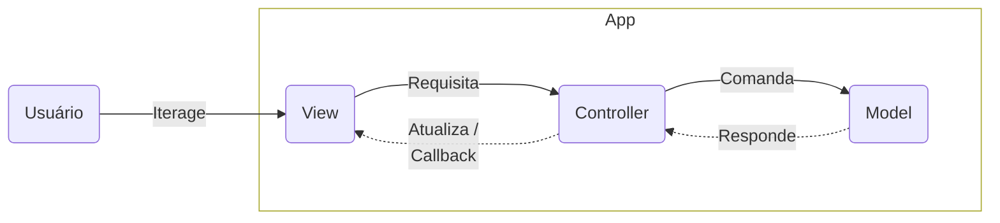

# TKinter Calculadora

Calculadora simples construída em [TKinter](https://docs.python.org/3/library/tk.html), uma livraria para criar interfaces, com uma modularização MVC para compreender o comportamento e uso desta ferramenta.

## Uso
Inicializar o ambiente.
```python
pipenv shell
```

Executar o aplicativo.
```python
python run.py
```

## Conceitos

### _Widget_

Os componentes de ilustração ou interação os quais podem ser botões, caixas de texto, rótulos, menus, entre outros. Esses componentes podem ser personalizados com suas múltiplas propriedades.

### _Geometry_

A estrutura dos componentes pode ser de três tipos diferentes em relação a seu widget parente:

- _Pack_: Os widgets são organizados como bem entenderem.
- _Grid_: Os widgets são organizados em uma estrutura de linhas e colunas.
- _Place_: Os widgets são posicionados em posições especificas.

### _Frame_

O componente que permite conter e organizar outros componentes, ele, como qualquer outro widget tem suas opções de personalização. Funcionam de forma idêntica ao elemento div de HTML.


### _MVC_

Para projetos maiores, é fortemente recomendado modularizar o código de forma que ele consiga ser escalado e desenvolvido de forma eficiente.

- _Model_: A camada que contem a parte logica da aplicação, tudo o que a aplicação faz, gerencia comportamentos por meio de regras, logicas e funções.
- _View_: A camada que que apresenta os dados solicitados do Model, porem também provoca interações com o usuário, que interage por meio do Controller.
- _Controller_: A camada que coordena as interações.




 ## Recursos

[How to Create & Structure a Complex Tkinter Application 2022 | by Raoof Naushad | DataDrivenInvestor](https://medium.datadriveninvestor.com/how-to-create-structure-a-complex-tkinter-application-2022-26e4a9907a6d)


[Python - GUI Programming (Tkinter) (tutorialspoint.com)](https://www.tutorialspoint.com/python/python_gui_programming.htm)

[Python Tkinter Frame - Javatpoint](https://www.javatpoint.com/python-tkinter-frame)

[ToyMVC - Gist](https://gist.githubusercontent.com/ajfigueroa/c2af555630d1db3efb5178ece728b017/raw/913d9ec42a7092ca0d4b36f21dc47b6404aefaf9/toymvc_example.py)

[Python Tkinter Grid - Bijay Kumar](https://pythonguides.com/python-tkinter-grid/)

[Swapping between frames - Dr. Andy Wicks (YouTube)](https://www.youtube.com/watch?v=e6ktaqlXaec)

[Adding a menu bar - Dr. Andy Wicks (YouTube)](https://www.youtube.com/watch?v=R8I9LZMPsxA)